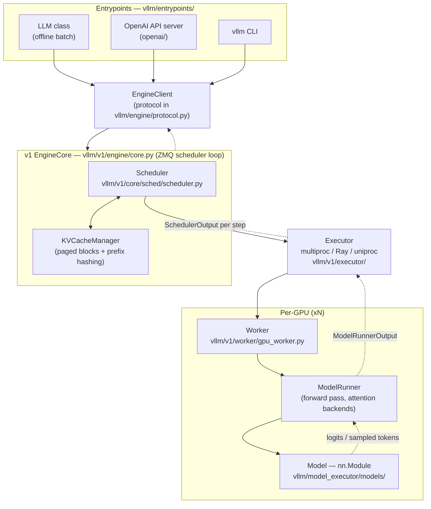
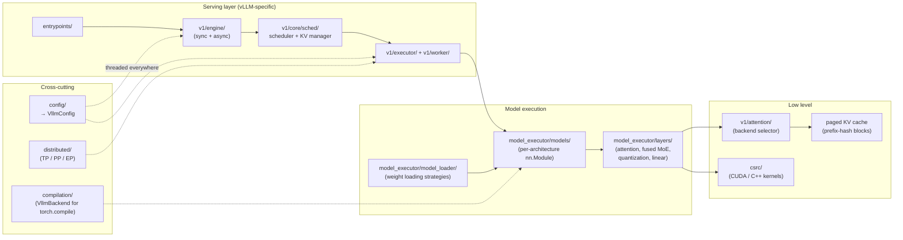
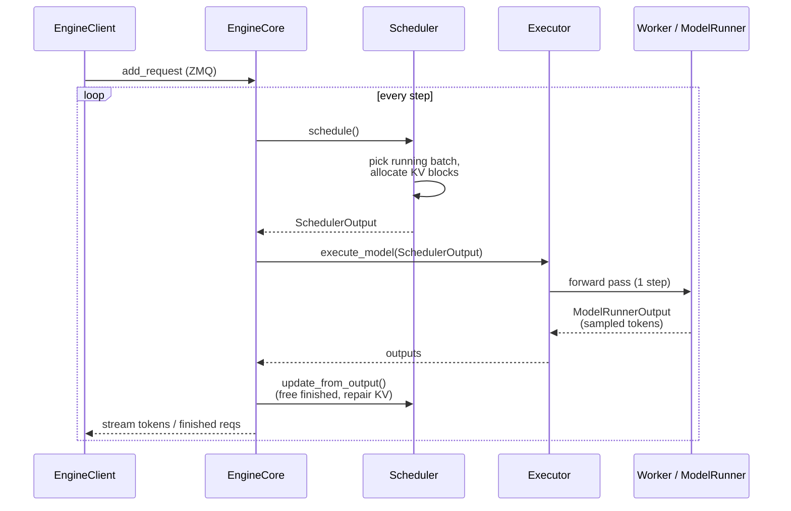
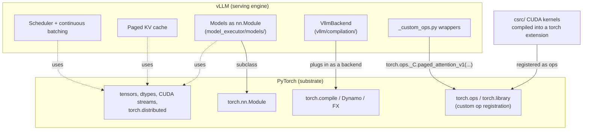

# vLLM Architecture

Diagrams of how vLLM is structured and how it sits on top of PyTorch. The
codebase runs on the **v1 engine** as the production path; legacy
`vllm/engine/` is mostly thin re-export aliases into `vllm/v1/`.

## 1. Request flow (top to bottom)

From a user request down to a GPU forward pass.

## 2. Component / module map

The major packages and what each owns.

## 3. The EngineCore step loop

`EngineCore` runs a continuous-batching loop: each step the scheduler
selects a batch, the executor runs one forward pass, and finished/streaming
tokens flow back. Requests join and leave the running batch at any step —
they do not wait for a whole batch to finish.

## 4. vLLM on top of PyTorch

vLLM is a framework built **on top of** PyTorch, not a replacement. PyTorch
provides the tensor/kernel/compiler substrate; vLLM adds scheduling, paged
memory management, and serving. The two connect at four well-defined seams.

### Who owns what

| Concern | Owner |
|---|---|
| Tensor ops, dtypes, CUDA streams, distributed comm | **PyTorch** |
| Model definitions (`nn.Module`), forward-pass graph | **Both** — PyTorch modules, vLLM-specific layers |
| Custom kernels (paged attention, fused MoE, quant) | **vLLM**, exposed *as* PyTorch ops via `torch.ops` / `torch.library` |
| Graph compilation | **vLLM backend** plugged into **PyTorch's** `torch.compile` |
| Scheduling, continuous batching, paged KV cache, serving | **vLLM** |

> **Mental model:** PyTorch gives vLLM the tensor/kernel/compiler machinery;
> vLLM uses it to build a serving engine that PyTorch alone doesn't provide.
> vLLM extends PyTorch through its own extension points — custom ops, compile
> backends, and `nn.Module` — rather than forking it.

## Pointers into the code

- `vllm/entrypoints/` — `llm.py`, `openai/`, `cli/`
- `vllm/v1/engine/core.py` — EngineCore, the ZMQ scheduler loop
- `vllm/v1/core/sched/scheduler.py` — scheduler + `KVCacheManager`
- `vllm/v1/executor/`, `vllm/v1/worker/` — executors and workers
- `vllm/model_executor/models/` — per-architecture `nn.Module` impls
- `vllm/model_executor/layers/` — reusable attention / MoE / quant layers
- `vllm/_custom_ops.py` — Python wrappers over `torch.ops._C.*` kernels
- `vllm/compilation/backends.py` — `VllmBackend` for `torch.compile`
- `csrc/` — CUDA / C++ kernel sources
- `vllm/config/` — per-concern dataclasses aggregated into `VllmConfig`
