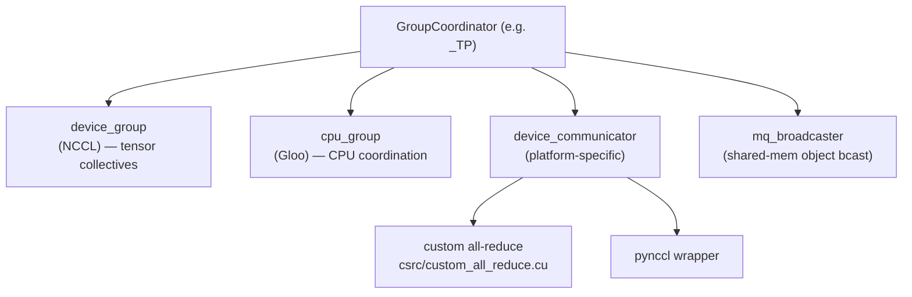
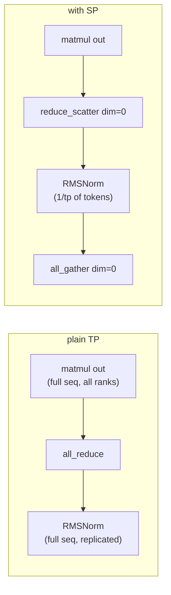
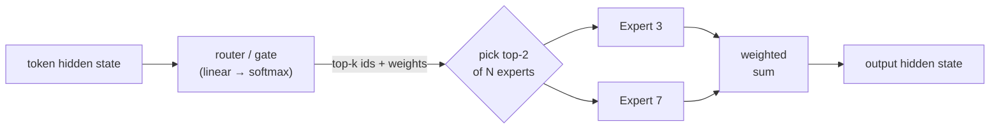
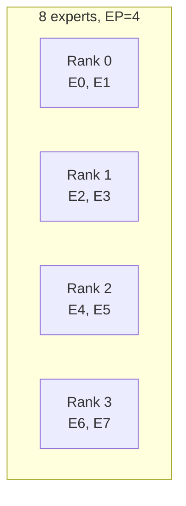
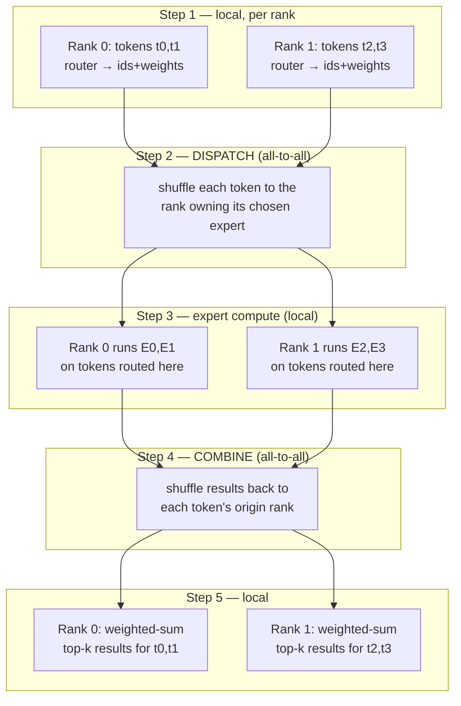
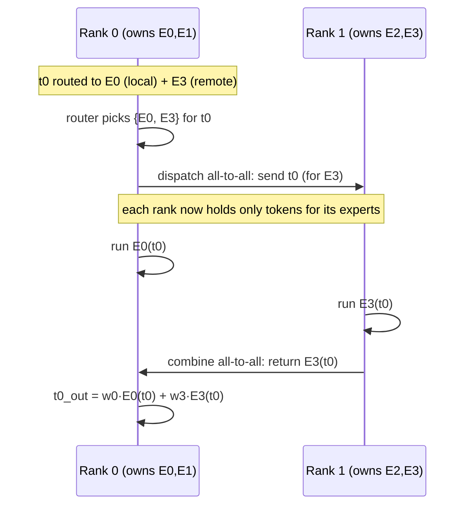

# Distributed Execution

**Core idea: one model, many GPUs. `vllm/distributed/` provides the process
groups and collective communication primitives that let a model be split across
devices and nodes along four independent axes — tensor, pipeline, data, and
expert parallelism — composed into a single rank grid. Everything is a thin,
vLLM-flavored wrapper over PyTorch's `torch.distributed` `ProcessGroup`.**

Sits under the executor/worker layer of [arch.md](arch.md): the executor spawns
one worker per GPU, and each worker joins the parallel groups defined here. The
model layers in `vllm/model_executor/layers/` call into these groups to shard
weights and exchange activations.

## The four parallelism axes

| Axis | What is split | Communication per step | When |
|---|---|---|---|
| **TP** — tensor parallel | Each weight matrix, *within* a layer | All-reduce (≈2 per transformer layer) | Model too big for one GPU; low-latency |
| **PP** — pipeline parallel | Layers into sequential stages | Point-to-point send/recv between stages | Model spans many GPUs/nodes |
| **DP** — data parallel | Nothing — full replicas | None for the model itself | Throughput; independent request streams |
| **EP** — expert parallel | MoE experts across ranks | All-to-all dispatch/combine | MoE models |

Plus **context parallel** (PCP prefill / DCP decode) which shards the sequence
dimension of attention — a newer axis layered alongside TP.

These compose. `world_size = TP × PP` is the number of workers in **one model
replica** (`config/parallel.py:293`); DP then runs `data_parallel_size` such
replicas. EP is carved from the TP×DP ranks.

## The rank grid

`initialize_model_parallel` (`parallel_state.py:1486`) lays all ranks out as a
multi-dimensional grid, then slices process groups from it. The layout order
(`parallel_state.py:1552`):

```
ExternalDP  ×  DP  ×  PP  ×  PCP  ×  TP
                                    ^^^^ innermost
```

TP is **innermost** on purpose: adjacent global ranks land in the same TP group,
so TP's chatty all-reduces ride the fastest interconnect (NVLink within a node).

Worked example from the docstring — 8 GPUs, TP=2, PP=4:

```
4 tensor-parallel groups : [g0,g1] [g2,g3] [g4,g5] [g6,g7]
2 pipeline-parallel groups: [g0,g2,g4,g6] [g1,g3,g5,g7]
```

Each GPU belongs to exactly one group per axis. The slicing is just tensor
reshape/transpose/unbind over `torch.arange(world_size)`
(`parallel_state.py:1561`).

## GroupCoordinator — the central abstraction

Every axis is represented by a `GroupCoordinator` (`parallel_state.py:290`): a
wrapper around a PyTorch `ProcessGroup` that owns *all* communication for that
group. Held as module-global singletons, fetched via getters:

| Getter | Global | Axis |
|---|---|---|
| `get_world_group()` | `_WORLD` | all ranks |
| `get_tp_group()` | `_TP` | tensor parallel |
| `get_pp_group()` | `_PP` | pipeline parallel |
| `get_dp_group()` | `_DP` | data parallel |
| `get_ep_group()` | `_EP` | expert parallel |

Each `GroupCoordinator` actually creates **two** backing groups
(`parallel_state.py:338`):

- a **`device_group`** (NCCL on CUDA) for fast GPU↔GPU tensor collectives, and
- a **`cpu_group`** (Gloo) for CPU-side coordination (metadata, control flow)
  that must not block on the GPU.

It also holds a platform-specific **`device_communicator`** and an optional
shared-memory **`mq_broadcaster`** (`MessageQueue`) for broadcasting Python
objects (e.g. the `SchedulerOutput`) cheaply within a node.



## Device communicators (the pluggable backend)

`GroupCoordinator` delegates the actual collectives to a
`DeviceCommunicatorBase` subclass (`base_device_communicator.py:118`) chosen by
platform:

| Platform | Communicator |
|---|---|
| CUDA | `cuda_communicator.py` |
| CPU | `cpu_communicator.py` |
| XPU (Intel) | `xpu_communicator.py` |
| Ray-managed | `ray_communicator.py` |

The interface is the collective vocabulary: `all_reduce`, `all_gather`,
`reduce_scatter`, `gather`, `send`/`recv`, `broadcast`, plus MoE-specific
`dispatch` / `combine` (all-to-all). The CUDA communicator can route an
all-reduce through several backends depending on size and topology:

- **custom all-reduce** — vLLM's own one-shot/two-shot kernels in
  `csrc/custom_all_reduce.cu` (fast for small tensors over NVLink);
- **pynccl** — a Python wrapper over NCCL (`pynccl.py`) for the general case;
- **flashinfer / quick / symm-mem** variants for specific hardware.

This is the [arch.md](arch.md) "vLLM extends PyTorch" pattern again: the custom
kernels register as ops, and the communicator picks the best one per call.

## How TP actually shards a layer

TP is the axis most visible in model code. Two linear-layer flavors split the
weight in complementary directions so that communication is needed only once per
pair (`vllm/model_executor/layers/linear.py`):

| Layer | Weight split | Output | Communication |
|---|---|---|---|
| `ColumnParallelLinear` (`linear.py:410`) | columns: `A = [A_1 … A_p]` | sharded `Y_i = X·A_i` | none (unless `gather_output`) |
| `RowParallelLinear` (`linear.py:1389`) | rows: input is sharded | partial sums | **all-reduce** to sum |

A transformer block is built so the two cancel out:

```
                 ColumnParallel        RowParallel
  attention:  QKV proj (split)  →  ...  →  O proj  → all-reduce
       MLP:  gate/up (split)    →  act  →  down    → all-reduce
```

So each layer does **two all-reduces** (one after attention, one after MLP), and
nothing in between needs to communicate — the sharded intermediate activations
stay local. `QKVParallelLinear` (`linear.py:977`) and
`MergedColumnParallelLinear` (`linear.py:609`) are column-parallel layers that
also pack multiple projections into one sharded matmul.
`VocabParallelEmbedding` (`vocab_parallel_embedding.py:192`) shards the
vocabulary across TP ranks for the embedding and LM head.

## Sequence parallelism (SP) — a TP companion

SP is **not a standalone axis** like TP/PP/DP/EP — there is no `_SP`
`GroupCoordinator`. It reuses the **TP group** and is realized as a
`torch.compile` **graph rewrite** of TP's collectives
(`compilation/passes/fusion/sequence_parallelism.py`), enabled by
`CompilationConfig.enable_sp` (`config/compilation.py:129`, requires TP>1).

The problem it fixes: in plain TP the regions *between* the two per-layer
all-reduces — the RMSNorm and residual adds — are **replicated** on every TP
rank. Every rank redundantly normalizes the full-length sequence and stores the
full-length activations. SP shards those regions along the **token dimension**.

The pass matches `all_reduce → rms_norm` and rewrites it
(`sequence_parallelism.py:133`):

```
plain TP :  all_reduce(x)                  → rms_norm(...)
   SP    :  reduce_scatter(x, dim=0)        → rms_norm(...) → all_gather(..., dim=0)
```

`dim=0` is the token dimension. The crucial property: **`reduce_scatter` +
`all_gather` move the same total bytes as one `all_reduce`** — so communication
volume is unchanged — but between them each rank handles only `1/tp` of the
tokens.



So SP is a near-free win **on top of** TP: it cuts redundant LayerNorm compute
and, more importantly, **activation memory** to `1/tp` in those regions. It is
**size-gated** (`get_sequence_parallelism_threshold`, `sequence_parallelism.py:44`)
— only applied when `hidden_size` and token count are large enough to pay off
(e.g. H100: `hidden_size ≥ 8192`), auto-disabled otherwise.

*Async TP* (`fuse_gemm_comms`, "Enable async TP") layers on top, overlapping the
GEMM with the SP collectives (`collective_fusion.py:409`). Separately,
**sequence-parallel MoE** (`use_sequence_parallel_moe`, `config/parallel.py:611`)
keeps expert inputs sequence-parallel so dispatch/combine needn't gather the
full sequence first — this is why `is_sequence_parallel` threads through the
`dispatch`/`combine` calls.

### Worked example: TP + SP on an MLP

Take the classic Megatron MLP — `X @ W1 @ W2` with `S=2` tokens, `H=4`, on
`P=2` devices. TP shards `W1` by column (`ColumnParallel`, no comm) and `W2` by
row (`RowParallel`, needs reduction), then the block does RMSNorm:

```
TP only:
Device 0: X[2x4] @ W1a[4x2] @ W2a[2x4] = partial0[2x4]
Device 1: X[2x4] @ W1b[4x2] @ W2b[2x4] = partial1[2x4]

all_reduce:  partial0[2x4] + partial1[2x4] = Y[2x4]   ← full on BOTH devices
RMSNorm(Y[2x4]) on Device 0 → Z[2x4]   ┐
RMSNorm(Y[2x4]) on Device 1 → Z[2x4]   ┘ ← identical work done twice (redundant)
```

SP leaves the matmuls untouched but replaces `all_reduce` with `reduce_scatter`,
norms the sharded tokens, then `all_gather`s back (`S/P = 1` token per device):

```
TP + SP:
Device 0: X[2x4] @ W1a[4x2] @ W2a[2x4] = partial0[2x4]   ← matmuls UNCHANGED
Device 1: X[2x4] @ W1b[4x2] @ W2b[2x4] = partial1[2x4]

reduce_scatter(dim=0):       # sum across devices, keep only 1/P of the rows (tokens)
   Device 0 ← (partial0+partial1)[row 0:1] = Y[1x4]   (token 0)
   Device 1 ← (partial0+partial1)[row 1:2] = Y[1x4]   (token 1)
RMSNorm:
   Device 0: RMSNorm(Y[1x4]) = Z[1x4]   ← norms ONLY token 0
   Device 1: RMSNorm(Y[1x4]) = Z[1x4]   ← norms ONLY token 1
all_gather(dim=0):           # reassemble full sequence for the next ColumnParallel
   both devices → Z[2x4]
```

Identical result because RMSNorm is per-token: `RMSNorm(Y[2x4])[row j] ==
RMSNorm(Y[row j])`. The numbers, with `N = S·H = 8` elements, `P = 2`:

| | Communication / device | RMSNorm input / device |
|---|---|---|
| **TP** | `all_reduce` = `2(P-1)/P·N` = **8** | `[2x4]` = 8 elems, 2 tokens |
| **TP+SP** | `reduce_scatter`+`all_gather` = `4+4` = **8** | `[1x4]` = 4 elems, 1 token |

Same bytes on the wire (`all_reduce` *is* `reduce_scatter`+`all_gather`
internally), but `1/P` the activation memory and norm compute in the middle.
Across a deep model the residual stream stays sharded `[1x4]` between blocks and
is only gathered at matmul inputs, so the `1/P` memory saving **compounds over
every layer** — that's the real payoff at scale.

### SP vs context parallel (CP) — don't conflate

Both shard "the sequence," but for opposite reasons:

| | Shards | Of what | Purpose | Standalone axis? |
|---|---|---|---|---|
| **SP** | token dim | the RMSNorm/residual regions *around* TP matmuls | cut redundant TP activation memory/compute | No — reuses TP group |
| **CP** (PCP/DCP) | sequence dim | attention + KV cache | fit / parallelize very long contexts | Yes — own group, in the rank grid |

## Expert parallelism (EP) in detail

EP is the MoE-specific axis, and it's worth its own section because it uses a
*different* collective than every other axis — **all-to-all instead of
all-reduce**.

### What MoE creates

A Mixture-of-Experts layer replaces the dense MLP with *N* expert MLPs plus a
**router** (gate). For each token the router picks the **top-k** experts (e.g.
top-2 of 256) and only those run — huge parameter count, small *active* compute
per token.



With 256 experts the weights don't fit on one GPU, and replicating them on every
GPU (the TP approach) wastes memory. EP shards the **experts themselves** across
ranks — each rank owns a disjoint slice.

### How experts are sharded

`determine_expert_map` (`fused_moe/layer.py:71`) splits `global_num_experts`
across `ep_size` ranks: `local_num_experts = global_num_experts // ep_size`
(+1 to absorb the remainder). It builds an `expert_map: global_id → local_id`
(or `-1` when that expert isn't on this rank).



Each rank holds **whole experts**, not slices — the key contrast with TP.

### The heart: dispatch → compute → combine

A token's top-k experts may live on *other* ranks, so every MoE layer does an
**all-to-all shuffle** to bring tokens to their experts, then another to send
results back. This is the `dispatch` / `combine` pair on the device communicator
(`base_device_communicator.py:344` and `:363`).



The journey of one token across ranks:



### Why all-to-all, not all-reduce

The deep reason EP uses a different collective than TP:

- **TP** splits a single matmul, so each rank produces a *partial result for the
  same tokens* → you **sum** them (all-reduce).
- **EP** splits *which tokens go where*, so each rank produces *complete results
  for different tokens* → you **route** them (all-to-all). Nothing is summed
  across ranks; tokens are permuted to their experts and back.

### EP vs TP for the same MoE layer

| | TP (tensor parallel) | EP (expert parallel) |
|---|---|---|
| Unit split | each expert matrix, by row/col | whole experts, by id |
| Per-rank work | a slice of *all* selected experts | *all* of a *few* experts |
| Communication | all-reduce (sum partial activations) | all-to-all ×2 (route tokens, route back) |
| Memory | every rank stores every expert (sliced) | each rank stores only its experts |
| Scales with | matrix dimensions | number of experts |

EP wins when there are many experts (the TP slice gets tiny and inefficient).
The two are often **combined** — `ep_size = tp_size × dp_size` — so router
output is gathered across the TP×DP ranks and experts spread over all of them.

### Pluggable all-to-all backends

`dispatch`/`combine` are implemented by an `All2AllManager`
(`device_communicators/all2all.py`), chosen by config — the same per-regime
pattern as the all-reduce path:

| Manager | Mechanism | Use |
|---|---|---|
| `AgRsAll2AllManager` (`:41`) | naive all-gather + reduce-scatter | baseline, no special kernels |
| `DeepEPHTAll2AllManager` (`:197`) | DeepEP **high-throughput** kernels | large batches / prefill |
| `DeepEPLLAll2AllManager` (`:261`) | DeepEP **low-latency** kernels (RDMA, no SMs) | decode, latency-critical |
| `NixlEPAll2AllManager` (`:334`) | NIXL EP kernels | cross-node transport |

**EPLB** (`distributed/eplb/`) sits alongside, periodically rebalancing which
experts live on which rank so load stays even — some experts get picked far more
often than others, and an imbalanced layer is as slow as its busiest rank.

## The other axes, briefly

- **PP** — `get_pp_group()` ranks form a chain. Each stage runs a slice of the
  layers, then `send`s its hidden states to the next stage and `recv`s from the
  previous one. Throughput comes from keeping all stages busy on different
  microbatches; the scheduler interacts with PP via the executor.
- **DP** — replicas are independent, *except* all ranks in a DP group must call
  `generate` together or risk deadlock (`parallel_state.py:1556`), because they
  synchronize on shared collectives (notably for MoE/EP). The model weights are
  not split — each replica has a full `world_size = TP×PP` set of workers.
- **EP** — for MoE, experts are partitioned across ranks; see the dedicated
  section below.

## Beyond model parallelism

`vllm/distributed/` also houses cross-process data movement that isn't about
splitting the model:

- **`kv_transfer/`** — moving KV cache between engines (prefill/decode
  disaggregation, the `KVConnector` the [scheduler](scheduler.md) and
  [KV cache manager](kv_cache_manager.md) hook into).
- **`weight_transfer/`** — streaming updated weights (RLHF), via NCCL or IPC.
- **`kv_events.py`** — publishing prefix-cache block events.
- **`device_communicators/shm_broadcast.py`** — the shared-memory `MessageQueue`
  used to fan `SchedulerOutput` out to workers without serializing over the
  network.

## Invariants worth remembering

- **One worker per GPU; `world_size = TP × PP` per replica.** DP multiplies
  replicas; it does not split weights.
- **TP is innermost in the rank grid** so its all-reduces stay on NVLink.
- **Each `GroupCoordinator` owns both an NCCL device group and a Gloo CPU
  group** — tensors on the former, control/metadata on the latter.
- **TP cost is two all-reduces per layer**, made cheap by the
  column-then-row sharding that keeps intermediates local.
- **DP ranks must step in lockstep** (call `generate` together) or deadlock on
  shared collectives.
- **EP routes, TP sums.** EP holds whole experts and shuffles tokens with
  all-to-all (`dispatch`/`combine`); TP holds matrix slices and sums with
  all-reduce. The collective differs because the split differs.
- **SP is a TP rewrite, not an axis.** It reuses the TP group and turns
  `all_reduce` into `reduce_scatter`+`all_gather` to shard the norm/residual
  regions by token — same bytes, less activation memory. CP is the real
  sequence-sharding axis (for attention/KV).
- **Communication backend is pluggable per platform and per call** — custom
  all-reduce kernel, pynccl, or a vendor variant, chosen by size/topology.

## Pointers into the code

- `vllm/distributed/parallel_state.py:290` — `GroupCoordinator`
- `vllm/distributed/parallel_state.py:1486` — `initialize_model_parallel` (rank grid)
- `vllm/distributed/parallel_state.py:1221` — `get_tp_group` (and `get_pp/dp/ep_group` nearby)
- `vllm/distributed/communication_op.py` — top-level `tensor_model_parallel_all_reduce` etc.
- `vllm/distributed/device_communicators/base_device_communicator.py:118` — `DeviceCommunicatorBase`
- `vllm/distributed/device_communicators/cuda_communicator.py` — CUDA backend
- `vllm/distributed/device_communicators/pynccl.py` — NCCL wrapper
- `vllm/distributed/device_communicators/base_device_communicator.py:344` / `:363` — `dispatch` / `combine` (EP all-to-all)
- `vllm/distributed/device_communicators/all2all.py` — EP all-to-all backends (`AgRs`, `DeepEP` HT/LL, `Nixl`)
- `vllm/model_executor/layers/fused_moe/layer.py:71` — `determine_expert_map` (expert sharding)
- `vllm/model_executor/layers/fused_moe/layer.py:219` — `FusedMoE`
- `vllm/distributed/eplb/` — expert-load-balancing (EPLB)
- `vllm/model_executor/layers/linear.py:410` / `:1389` — Column/Row parallel linear
- `vllm/model_executor/layers/vocab_parallel_embedding.py:192` — vocab sharding
- `vllm/compilation/passes/fusion/sequence_parallelism.py:133` — `SequenceParallelismPass` (SP rewrite)
- `vllm/config/compilation.py:129` — `enable_sp` (SP flag) / `fuse_gemm_comms` (async TP)
- `vllm/config/parallel.py` — `ParallelConfig` (TP/PP/DP/EP sizes, `world_size`)
- `csrc/custom_all_reduce.cu` — custom all-reduce CUDA kernels
