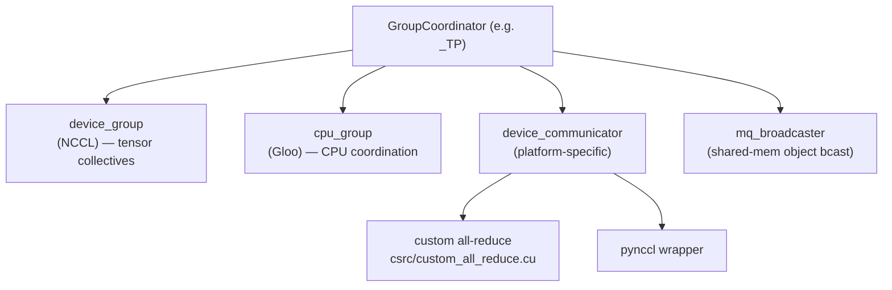

# Distributed Execution

**Core idea: one model, many GPUs. `vllm/distributed/` provides the process
groups and collective communication primitives that let a model be split across
devices and nodes along four independent axes — tensor, pipeline, data, and
expert parallelism — composed into a single rank grid. Everything is a thin,
vLLM-flavored wrapper over PyTorch's `torch.distributed` `ProcessGroup`.**

Sits under the executor/worker layer of [arch.md](arch.md): the executor spawns
one worker per GPU, and each worker joins the parallel groups defined here. The
model layers in `vllm/model_executor/layers/` call into these groups to shard
weights and exchange activations.

## The four parallelism axes

| Axis | What is split | Communication per step | When |
|---|---|---|---|
| **TP** — tensor parallel | Each weight matrix, *within* a layer | All-reduce (≈2 per transformer layer) | Model too big for one GPU; low-latency |
| **PP** — pipeline parallel | Layers into sequential stages | Point-to-point send/recv between stages | Model spans many GPUs/nodes |
| **DP** — data parallel | Nothing — full replicas | None for the model itself | Throughput; independent request streams |
| **EP** — expert parallel | MoE experts across ranks | All-to-all dispatch/combine | MoE models |

Plus **context parallel** (PCP prefill / DCP decode) which shards the sequence
dimension of attention — a newer axis layered alongside TP.

These compose. `world_size = TP × PP` is the number of workers in **one model
replica** (`config/parallel.py:293`); DP then runs `data_parallel_size` such
replicas. EP is carved from the TP×DP ranks.

## The rank grid

`initialize_model_parallel` (`parallel_state.py:1486`) lays all ranks out as a
multi-dimensional grid, then slices process groups from it. The layout order
(`parallel_state.py:1552`):

```
ExternalDP  ×  DP  ×  PP  ×  PCP  ×  TP
                                    ^^^^ innermost
```

TP is **innermost** on purpose: adjacent global ranks land in the same TP group,
so TP's chatty all-reduces ride the fastest interconnect (NVLink within a node).

Worked example from the docstring — 8 GPUs, TP=2, PP=4:

```
4 tensor-parallel groups : [g0,g1] [g2,g3] [g4,g5] [g6,g7]
2 pipeline-parallel groups: [g0,g2,g4,g6] [g1,g3,g5,g7]
```

Each GPU belongs to exactly one group per axis. The slicing is just tensor
reshape/transpose/unbind over `torch.arange(world_size)`
(`parallel_state.py:1561`).

## GroupCoordinator — the central abstraction

Every axis is represented by a `GroupCoordinator` (`parallel_state.py:290`): a
wrapper around a PyTorch `ProcessGroup` that owns *all* communication for that
group. Held as module-global singletons, fetched via getters:

| Getter | Global | Axis |
|---|---|---|
| `get_world_group()` | `_WORLD` | all ranks |
| `get_tp_group()` | `_TP` | tensor parallel |
| `get_pp_group()` | `_PP` | pipeline parallel |
| `get_dp_group()` | `_DP` | data parallel |
| `get_ep_group()` | `_EP` | expert parallel |

Each `GroupCoordinator` actually creates **two** backing groups
(`parallel_state.py:338`):

- a **`device_group`** (NCCL on CUDA) for fast GPU↔GPU tensor collectives, and
- a **`cpu_group`** (Gloo) for CPU-side coordination (metadata, control flow)
  that must not block on the GPU.

It also holds a platform-specific **`device_communicator`** and an optional
shared-memory **`mq_broadcaster`** (`MessageQueue`) for broadcasting Python
objects (e.g. the `SchedulerOutput`) cheaply within a node.



## Device communicators (the pluggable backend)

`GroupCoordinator` delegates the actual collectives to a
`DeviceCommunicatorBase` subclass (`base_device_communicator.py:118`) chosen by
platform:

| Platform | Communicator |
|---|---|
| CUDA | `cuda_communicator.py` |
| CPU | `cpu_communicator.py` |
| XPU (Intel) | `xpu_communicator.py` |
| Ray-managed | `ray_communicator.py` |

The interface is the collective vocabulary: `all_reduce`, `all_gather`,
`reduce_scatter`, `gather`, `send`/`recv`, `broadcast`, plus MoE-specific
`dispatch` / `combine` (all-to-all). The CUDA communicator can route an
all-reduce through several backends depending on size and topology:

- **custom all-reduce** — vLLM's own one-shot/two-shot kernels in
  `csrc/custom_all_reduce.cu` (fast for small tensors over NVLink);
- **pynccl** — a Python wrapper over NCCL (`pynccl.py`) for the general case;
- **flashinfer / quick / symm-mem** variants for specific hardware.

This is the [arch.md](arch.md) "vLLM extends PyTorch" pattern again: the custom
kernels register as ops, and the communicator picks the best one per call.

## How TP actually shards a layer

TP is the axis most visible in model code. Two linear-layer flavors split the
weight in complementary directions so that communication is needed only once per
pair (`vllm/model_executor/layers/linear.py`):

| Layer | Weight split | Output | Communication |
|---|---|---|---|
| `ColumnParallelLinear` (`linear.py:410`) | columns: `A = [A_1 … A_p]` | sharded `Y_i = X·A_i` | none (unless `gather_output`) |
| `RowParallelLinear` (`linear.py:1389`) | rows: input is sharded | partial sums | **all-reduce** to sum |

A transformer block is built so the two cancel out:

```
                 ColumnParallel        RowParallel
  attention:  QKV proj (split)  →  ...  →  O proj  → all-reduce
       MLP:  gate/up (split)    →  act  →  down    → all-reduce
```

So each layer does **two all-reduces** (one after attention, one after MLP), and
nothing in between needs to communicate — the sharded intermediate activations
stay local. `QKVParallelLinear` (`linear.py:977`) and
`MergedColumnParallelLinear` (`linear.py:609`) are column-parallel layers that
also pack multiple projections into one sharded matmul.
`VocabParallelEmbedding` (`vocab_parallel_embedding.py:192`) shards the
vocabulary across TP ranks for the embedding and LM head.

## The other axes, briefly

- **PP** — `get_pp_group()` ranks form a chain. Each stage runs a slice of the
  layers, then `send`s its hidden states to the next stage and `recv`s from the
  previous one. Throughput comes from keeping all stages busy on different
  microbatches; the scheduler interacts with PP via the executor.
- **DP** — replicas are independent, *except* all ranks in a DP group must call
  `generate` together or risk deadlock (`parallel_state.py:1556`), because they
  synchronize on shared collectives (notably for MoE/EP). The model weights are
  not split — each replica has a full `world_size = TP×PP` set of workers.
- **EP** — for MoE, experts are partitioned across ranks. Each step routes
  tokens to the ranks owning their experts via **all-to-all** (`dispatch`),
  runs the experts locally, then **all-to-all** back (`combine`). Managed by the
  `All2AllManager` in `device_communicators/all2all.py`; EPLB
  (`distributed/eplb/`) rebalances expert placement to even out load.

## Beyond model parallelism

`vllm/distributed/` also houses cross-process data movement that isn't about
splitting the model:

- **`kv_transfer/`** — moving KV cache between engines (prefill/decode
  disaggregation, the `KVConnector` the [scheduler](scheduler.md) and
  [KV cache manager](kv_cache_manager.md) hook into).
- **`weight_transfer/`** — streaming updated weights (RLHF), via NCCL or IPC.
- **`kv_events.py`** — publishing prefix-cache block events.
- **`device_communicators/shm_broadcast.py`** — the shared-memory `MessageQueue`
  used to fan `SchedulerOutput` out to workers without serializing over the
  network.

## Invariants worth remembering

- **One worker per GPU; `world_size = TP × PP` per replica.** DP multiplies
  replicas; it does not split weights.
- **TP is innermost in the rank grid** so its all-reduces stay on NVLink.
- **Each `GroupCoordinator` owns both an NCCL device group and a Gloo CPU
  group** — tensors on the former, control/metadata on the latter.
- **TP cost is two all-reduces per layer**, made cheap by the
  column-then-row sharding that keeps intermediates local.
- **DP ranks must step in lockstep** (call `generate` together) or deadlock on
  shared collectives.
- **Communication backend is pluggable per platform and per call** — custom
  all-reduce kernel, pynccl, or a vendor variant, chosen by size/topology.

## Pointers into the code

- `vllm/distributed/parallel_state.py:290` — `GroupCoordinator`
- `vllm/distributed/parallel_state.py:1486` — `initialize_model_parallel` (rank grid)
- `vllm/distributed/parallel_state.py:1221` — `get_tp_group` (and `get_pp/dp/ep_group` nearby)
- `vllm/distributed/communication_op.py` — top-level `tensor_model_parallel_all_reduce` etc.
- `vllm/distributed/device_communicators/base_device_communicator.py:118` — `DeviceCommunicatorBase`
- `vllm/distributed/device_communicators/cuda_communicator.py` — CUDA backend
- `vllm/distributed/device_communicators/pynccl.py` — NCCL wrapper
- `vllm/distributed/device_communicators/all2all.py` — EP all-to-all
- `vllm/model_executor/layers/linear.py:410` / `:1389` — Column/Row parallel linear
- `vllm/model_executor/layers/vocab_parallel_embedding.py:192` — vocab sharding
- `vllm/config/parallel.py` — `ParallelConfig` (TP/PP/DP/EP sizes, `world_size`)
- `csrc/custom_all_reduce.cu` — custom all-reduce CUDA kernels
