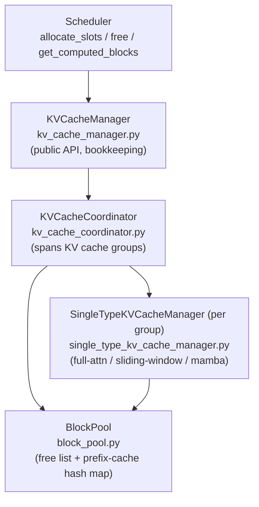
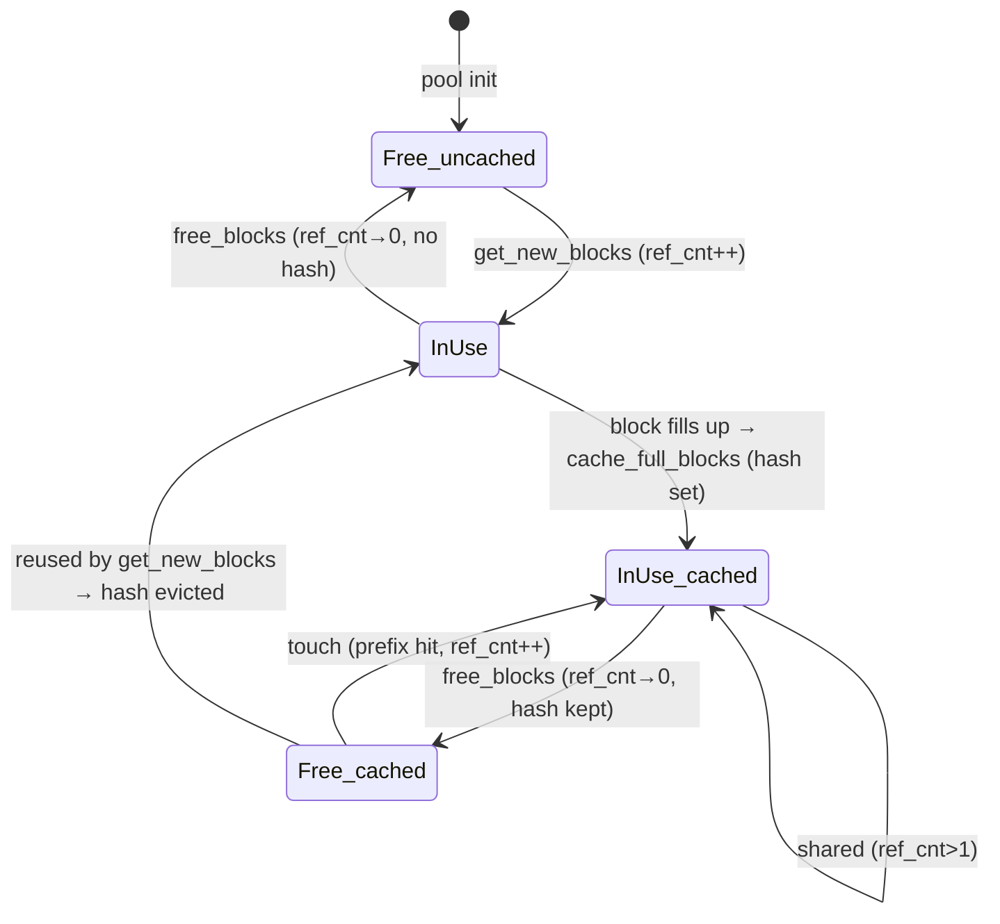
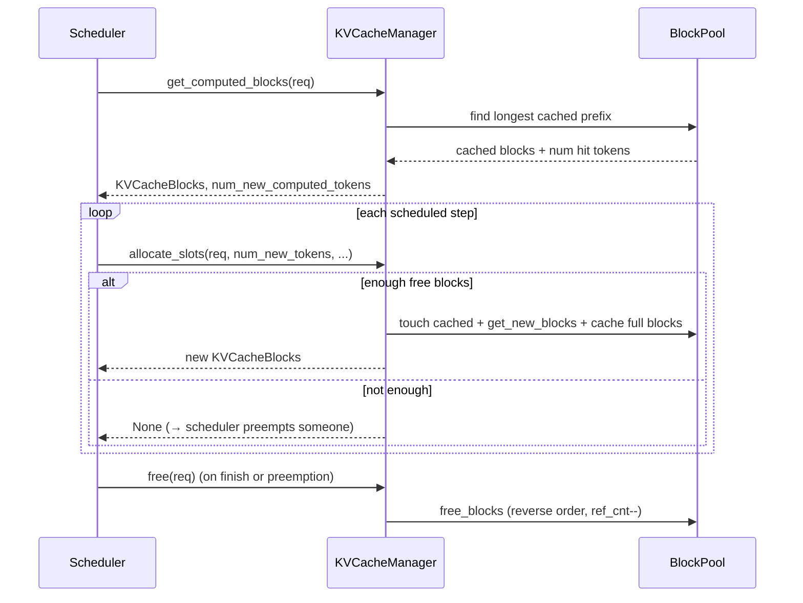

# The KV Cache Manager

**Core idea: GPU KV memory is carved into fixed-size blocks managed like OS
virtual-memory pages. The manager hands blocks to requests, reclaims them via
reference counting, and — when prefix caching is on — keeps *full* blocks
around keyed by a content hash so a later request with the same prefix can
reuse them instead of recomputing. Allocation failure is the single signal that
tells the scheduler to preempt.**

Lives in `vllm/v1/core/`. The scheduler (see [scheduler.md](scheduler.md))
only ever talks to `KVCacheManager`; everything below is internal. This note is
the block-level companion to [PagedAttention](optimizations/PagedAttention.md),
which explains *why* paging matters — this explains *how* the blocks are
booked.

## The layering



| Layer | File | Responsibility |
|---|---|---|
| `KVCacheManager` | `kv_cache_manager.py` | Public API, prefix-cache stats, packages results as `KVCacheBlocks` |
| `KVCacheCoordinator` | `kv_cache_coordinator.py` | Spans the **KV cache groups** of hybrid models, finds longest cache hit |
| `SingleTypeKVCacheManager` | `single_type_kv_cache_manager.py` | Per-group block math: full attention vs sliding window vs mamba |
| `BlockPool` | `block_pool.py` | The real allocator: free list + `hash → block` map |

The manager itself is thin — most methods delegate straight to
`self.coordinator`. The interesting state lives in `BlockPool`.

## The atom: a block

A block is just **metadata** (`KVCacheBlock`, `kv_cache_utils.py:110`); the
actual K/V tensors live in a giant pre-allocated GPU buffer indexed by
`block_id`. The metadata:

| Field | Meaning |
|---|---|
| `block_id` | Index into the GPU buffer, `0 .. num_gpu_blocks-1` |
| `ref_cnt` | How many requests currently hold this block |
| `_block_hash` | Content hash (+ group id) — set only when the block is **full and cached** |
| `prev_free_block` / `next_free_block` | Doubly-linked-list pointers, used only while free |
| `is_null` | The placeholder block (id 0); never cached or freed |

`block_id 0` is the **null block** (`block_pool.py:176`): a shared placeholder
used wherever a slot must exist but holds nothing real (e.g. positions outside
a sliding window). Its ref count is not maintained.

## BlockPool: free list + prefix cache

Two data structures do all the work (`block_pool.py:162-171`):

1. **`free_block_queue`** — a `FreeKVCacheBlockQueue`
   (`kv_cache_utils.py:158`), a doubly-linked list of all blocks with
   `ref_cnt == 0`, **ordered by eviction priority** (front = evict first).
   Using an intrusive linked list (pointers live on the block itself) makes
   "remove this specific block from the middle" O(1) — needed when a cached
   free block gets re-touched by a prefix hit.

2. **`cached_block_hash_to_block`** — a `BlockHashToBlockMap`
   (`block_pool.py:34`), mapping `(block_hash, group_id) → block`. This is the
   prefix cache index.

The subtle part: a block can be **simultaneously free and cached**. When a
request finishes, its full blocks go onto the free queue but *keep their hash
and stay in the map*. They are eviction candidates that still serve cache hits
— until they're actually popped for reuse, at which point their hash is
cleared.



### Reference counting

- **`get_new_blocks(n)`** (`block_pool.py:322`): pop `n` from the free-queue
  front, evicting any cached hash they still carry, set `ref_cnt = 1`.
- **`touch(blocks)`** (`block_pool.py:391`): a prefix hit on an existing block.
  If it was a free eviction candidate (`ref_cnt == 0`), pull it off the free
  queue; then `ref_cnt += 1`. This is how a prefix becomes **shared** across
  requests.
- **`free_blocks(ordered)`** (`block_pool.py:408`): `ref_cnt -= 1`; any block
  reaching 0 goes back on the free queue. Blocks are freed in **reverse order**
  (tail first) so the tail — least likely to be a reusable prefix — is evicted
  first.

## Prefix caching: content-addressed blocks

Each full block gets a hash chaining it to its predecessor
(`hash_block_tokens`, `kv_cache_utils.py:535`):

```python
block_hash = hash_fn((parent_block_hash, tuple(curr_block_token_ids), extra_keys))
```

Because the hash folds in the **parent block's hash**, it identifies the entire
prefix `[0 .. end_of_this_block)`, not just the local tokens — two sequences
collide on a block hash only if *every* preceding token also matched. The first
block's parent is a process-global `NONE_HASH` (`kv_cache_utils.py:87`, seeded
randomly or from a seed). `extra_keys` folds in multimodal features, LoRA id,
and an optional cache salt so unrelated requests can't alias
(`generate_block_hash_extra_keys`, `kv_cache_utils.py:497`).

Hashes are computed by the `Request` itself as tokens arrive (only for *full*
blocks — partial trailing tokens are never hashed), and stored in
`request.block_hashes`.

### Lookup on admission

When the scheduler considers a waiting request it calls
**`get_computed_blocks`** (`kv_cache_manager.py:176`):

- Delegates to `coordinator.find_longest_cache_hit(request.block_hashes,
  max_cache_hit_length)`, walking the request's block hashes against the cache
  map for the longest run of already-cached blocks.
- `max_cache_hit_length = num_tokens − 1` (`kv_cache_manager.py:201`): even on a
  100% hit, the **last token must be recomputed** to produce a logit to sample
  from. (Block-size alignment means this can force recomputing the final
  block.)
- Returns the matched blocks + `num_new_computed_tokens`. Those tokens count as
  already done — the request skips that much prefill for free.

### Caching on the way out

After `allocate_slots` places new blocks, it calls
`coordinator.cache_blocks(request, num_tokens_to_cache)`, which fills hash
metadata for newly-full blocks and inserts them into the map
(`cache_full_blocks`, `block_pool.py:211`). Key cap (`kv_cache_manager.py:421`):

```python
num_tokens_to_cache = min(total_computed_tokens + num_new_tokens, request.num_tokens)
```

The `min(..., request.num_tokens)` excludes **unverified speculative draft
tokens** — only finalized tokens get cached, so a rejected draft never pollutes
the prefix cache. This is the cache-side counterpart of the spec-decode KV
repair in [SpeculativeDecoding](optimizations/SpeculativeDecoding.md).

## `allocate_slots`: the heart

`allocate_slots` (`kv_cache_manager.py:257`) is what the scheduler calls every
step for every scheduled request. Its docstring carries the canonical block
layout:

```
| < comp > | < new_comp > | < ext_comp > | < new > | < lookahead > |
            \____ prefix-cached (vLLM / connector) ____/
                                          \__ to be computed __/
```

| Segment | Source |
|---|---|
| `comp` | `request.num_computed_tokens` — already has K/V |
| `new_comp` | local prefix-cache hit this step |
| `ext_comp` | external KV (a `KVConnector`, e.g. P/D disaggregation) |
| `new` | `num_new_tokens` to compute now (may include draft tokens) |
| `lookahead` | `num_lookahead_tokens` reserved for spec-decode drafts |

Three stages (`kv_cache_manager.py:327`):

1. **Free skipped blocks** (`remove_skipped_blocks`): drop blocks no longer
   needed, e.g. those that fell out of a sliding window. Done *before*
   allocating to minimize evictions.
2. **Compute demand and check supply.** `get_num_blocks_to_allocate(...)`; if it
   exceeds `block_pool.get_num_free_blocks()`, **return `None`** — the request
   cannot be scheduled.
3. **Allocate.** Attach any prefix-cached blocks (`allocate_new_computed_blocks`,
   bumping ref counts via `touch`), then `allocate_new_blocks` for the
   to-be-computed region, then cache the now-full finalized blocks.

> **`allocate_slots` returning `None` is the entire preemption trigger.** The
> scheduler's response (evict a running request, retry) is described in
> [scheduler.md](scheduler.md). The manager never decides *who* to preempt — it
> only reports "no room."

`free` (`kv_cache_manager.py:429`) returns all of a request's blocks to the pool
in reverse order. `can_fit_full_sequence` (`kv_cache_manager.py:218`) is an
admission gate: with chunked prefill, the per-step check only sizes the first
chunk, so this asks "is there room for the *whole* sequence?" to avoid
admitting a request that will inevitably get stuck.

## KV cache groups (hybrid models)

A pure transformer has one **KV cache group**. Hybrid models don't:

| Layer type | Spec (`kv_cache_interface.py`) | Block behavior |
|---|---|---|
| Full attention | `FullAttentionSpec` | Every token keeps K/V forever |
| Sliding window | `SlidingWindowSpec` | Old blocks drop out of the window → freed early |
| Mamba / SSM | (mamba spec) | Fixed-size recurrent state, different block math |

Each group has its own `SingleTypeKVCacheManager` with group-specific rules for
"how many blocks does N tokens need" and "which blocks can be skipped." The
`KVCacheCoordinator` fans allocation across groups and intersects their cache
hits — `find_longest_cache_hit` must hold in *every* group for a prefix to
count as cached. The block hash is tagged with `group_id`
(`make_block_hash_with_group_id`) so groups never alias each other's cache.

## How a request moves through it



## Invariants worth remembering

- **The manager allocates metadata, not memory.** Block tensors are
  pre-allocated once; `allocate_slots` just hands out `block_id`s.
- **`ref_cnt == 0` ⇒ on the free queue.** A block with no holders is always an
  eviction candidate; it may still carry a hash and serve cache hits until
  reused.
- **Only full blocks are cached, only finalized tokens cached.** Partial
  trailing blocks and unverified spec drafts are never inserted into the hash
  map.
- **Cache hits chain.** A block hash encodes its whole prefix, so a hit on block
  k guarantees blocks `0..k` all matched.
- **`allocate_slots → None` is the back-pressure signal.** It is the only thing
  that makes the scheduler preempt; the manager has no policy of its own.
- **Last token always recomputed.** `max_cache_hit_length = num_tokens − 1`
  ensures there's always a logit to sample.

## Pointers into the code

- `vllm/v1/core/kv_cache_manager.py:176` — `get_computed_blocks` (prefix lookup)
- `vllm/v1/core/kv_cache_manager.py:257` — `allocate_slots` (+ block-layout docstring)
- `vllm/v1/core/kv_cache_manager.py:429` — `free`
- `vllm/v1/core/block_pool.py:130` — `BlockPool`
- `vllm/v1/core/block_pool.py:322` — `get_new_blocks` (allocate + evict)
- `vllm/v1/core/block_pool.py:391` — `touch` (prefix sharing)
- `vllm/v1/core/block_pool.py:408` — `free_blocks` (ref-count return)
- `vllm/v1/core/kv_cache_utils.py:110` — `KVCacheBlock`
- `vllm/v1/core/kv_cache_utils.py:158` — `FreeKVCacheBlockQueue`
- `vllm/v1/core/kv_cache_utils.py:535` — `hash_block_tokens` (chained prefix hash)
- `vllm/v1/core/kv_cache_coordinator.py:28` — `KVCacheCoordinator`
- `vllm/v1/kv_cache_interface.py:80` — `KVCacheSpec` and per-type specs
