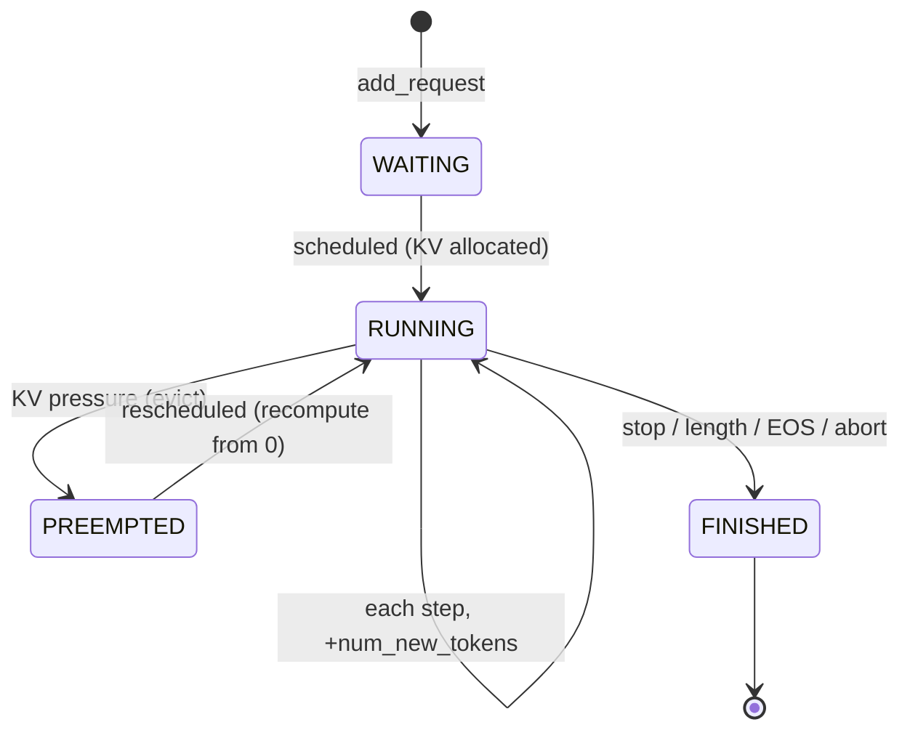
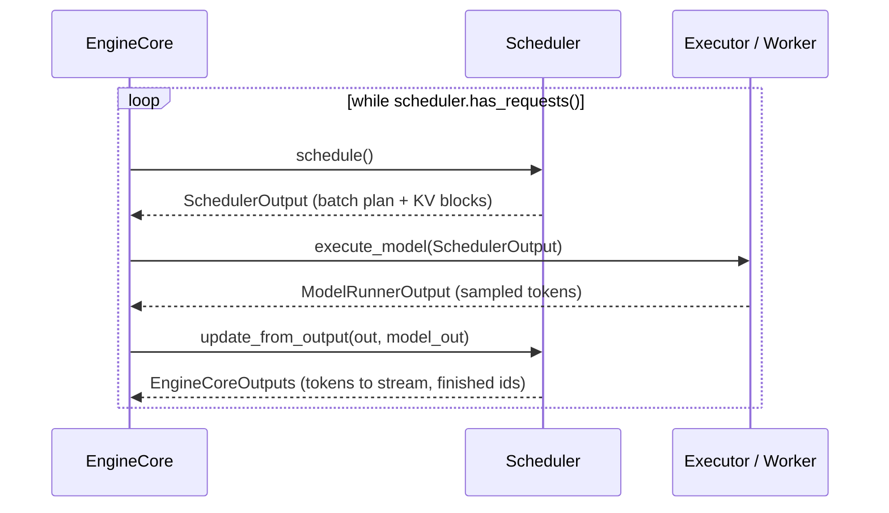

# The Scheduler Loop

**Core idea: there is no "prefill phase" and no "decode phase." Every request
carries a `num_computed_tokens` counter and a target `num_tokens_with_spec`;
each step the scheduler hands out a shared token budget so that requests' computed
counts catch up to their targets. Prefill, chunked prefill, decode, prefix
caching, and speculative decoding all fall out of that one rule.**

Lives in `vllm/v1/core/sched/scheduler.py`. Driven by `EngineCore` in
`vllm/v1/engine/core.py`. Emits a `SchedulerOutput` (`vllm/v1/core/sched/output.py`)
each step and consumes a `ModelRunnerOutput` to close the loop.

## The unified scheduling model

The single most important comment in the file
(`scheduler.py:349`):

> There's no "decoding phase" nor "prefill phase" in the scheduler. Each
> request just has `num_computed_tokens` and `num_tokens_with_spec`. At each
> step, the scheduler tries to assign tokens to the requests so that each
> request's `num_computed_tokens` can catch up to its `num_tokens_with_spec`.

Two counters per request decide everything:

| Counter | Meaning |
|---|---|
| `num_computed_tokens` | How many of this request's tokens already have K/V in the cache |
| `num_tokens_with_spec` | `len(prompt) + len(output_so_far) + len(spec_tokens)` — the target |

`num_new_tokens = num_tokens_with_spec + num_output_placeholders − num_computed_tokens`
is how much work the request *wants* this step. The scheduler grants
`min(that, token_budget, …)`. Three situations, same arithmetic:

| Situation | `num_computed_tokens` vs target | `num_new_tokens` granted |
|---|---|---|
| Fresh prompt (prefill) | 0 vs 1000 | up to 1000 (or a chunk) |
| Mid prompt (chunked prefill) | 600 vs 1000 | up to 400 |
| Generating (decode) | 1000 vs 1001 | 1 |
| Decode + 5 spec drafts | 1000 vs 1006 | up to 6 |

So "prefill vs decode" is just "is `num_new_tokens` big or small" — the
scheduler never branches on it. This is what makes **chunked prefill** and
**continuous batching** emergent rather than special-cased: a half-done prompt
and a generating request are scheduled by identical code.

## State: queues and statuses



The scheduler holds three collections (`scheduler.py:157-175`):

| Field | Type | Role |
|---|---|---|
| `self.requests` | `dict[str, Request]` | All live requests by id |
| `self.waiting` | `RequestQueue` | Not yet running (new or preempted) |
| `self.running` | `list[Request]` | Currently in the batch, front = oldest |
| `self.skipped_waiting` | `RequestQueue` | Waiting reqs skipped this step (e.g. remote-KV, LoRA cap) |
| `self.finished_req_ids` | `set[str]` | Finished since last step → told to workers to free state |

`RequestStatus` (`vllm/v1/request.py:299`) is an `IntEnum` ordered so that
`status > PREEMPTED` means finished. Notable: `WAITING`, `RUNNING`,
`PREEMPTED`, plus blocked-waiting variants (`WAITING_FOR_REMOTE_KVS`,
`WAITING_FOR_STRUCTURED_OUTPUT_GRAMMAR`), and finish reasons
(`FINISHED_STOPPED`, `FINISHED_LENGTH_CAPPED`, `FINISHED_ABORTED`, …).

Two scheduling policies (`request_queue.py`): **FCFS** (a `deque`) and
**PRIORITY** (a heap on `(priority, arrival_time)`). The policy only changes
queue ordering and which request gets preempted first.

## The EngineCore step

`EngineCore.step()` (`core.py:402`) is the whole loop, three calls:

```python
scheduler_output = self.scheduler.schedule()                       # 1. plan
future = self.model_executor.execute_model(scheduler_output, ...)  # 2. run
model_output = future.result()
engine_core_outputs = self.scheduler.update_from_output(           # 3. reconcile
    scheduler_output, model_output)
```



`schedule()` is **planning only** — it allocates KV blocks and advances
`num_computed_tokens` optimistically, but runs no model. `update_from_output()`
is **reconciliation** — it ingests the real sampled tokens, repairs the
optimistic bookkeeping (spec rejections), checks stop conditions, and frees
finished requests. (There's also `step_with_batch_queue()` at `core.py:443`
that pipelines multiple in-flight batches when the executor supports
concurrency; same three calls, overlapped.)

## `schedule()` — phase by phase

`schedule()` (`scheduler.py:348`) runs in two phases against one shared
`token_budget = max_num_scheduled_tokens` and a cap of `max_num_running_reqs`.

### Phase 1 — running requests first

`scheduler.py:385`. Walk `self.running` front to back while budget remains:

1. Compute `num_new_tokens` (target − computed), clamp to the long-prefill
   threshold, the remaining `token_budget`, and `max_model_len − 1`.
2. **Allocate KV slots** via `kv_cache_manager.allocate_slots(...)`
   (`scheduler.py:463`). This is where memory pressure bites.
3. **If allocation fails → preempt** (`scheduler.py:474`). Evict the
   lowest-priority running request (PRIORITY) or the *last* one (FCFS):
   `_preempt_request` frees its KV + encoder cache, resets its
   `num_computed_tokens = 0`, sets status `PREEMPTED`, and prepends it to the
   waiting queue. Retry allocation; if the request being scheduled is itself
   the one preempted, give up on it this step.
4. On success, record the new blocks, decrement the budget, and stash any
   speculative-decode draft tokens for this request (`scheduler.py:521`).

> Preemption is the pressure-relief valve. A preempted request loses **all**
> its computed tokens (`num_computed_tokens = 0`) and must recompute its prompt
> from scratch when resumed — prefix caching usually softens this.

### Phase 2 — pull in waiting requests

`scheduler.py:564`, only if nothing was preempted and budget remains, and only
while `len(self.running) < max_num_running_reqs`:

1. Peek the front of the waiting queue. Skip (and stash in
   `skipped_waiting`) requests blocked on remote KV transfer or that would
   exceed the `max_loras` cap.
2. **Prefix-cache lookup** (`scheduler.py:610`): for a brand-new request,
   `kv_cache_manager.get_computed_blocks()` finds locally cached blocks
   (prefix hashing), and a `KVConnector` may report externally cached tokens.
   These count as already-computed — free prefill.
3. `num_new_tokens = request.num_tokens − num_computed_tokens`. If chunked
   prefill is **disabled** and this exceeds the budget, stop scheduling
   waiting requests entirely (`break`). If **enabled**, clamp to the budget
   and schedule a partial chunk.
4. Allocate slots. On failure, `break` (no preemption in this phase — waiting
   requests yield to running ones).
5. Move the request to `self.running`, set status `RUNNING`, classify it as a
   new request (`scheduled_new_reqs`) or a resumed preempted one
   (`scheduled_resumed_reqs`).

### Building the SchedulerOutput

`scheduler.py:880`. The plan is packaged into `SchedulerOutput`:

| Field | Contents |
|---|---|
| `scheduled_new_reqs` | Full data for first-time requests (sent once, cached in workers) |
| `scheduled_cached_reqs` | **Diff only** for already-known requests (new tokens, new block ids) |
| `num_scheduled_tokens` | `req_id → count` for this step |
| `scheduled_spec_decode_tokens` | `req_id → draft tokens` to verify |
| `num_common_prefix_blocks` | Longest shared prefix → enables cascade attention |
| `finished_req_ids` | Finished since last step → workers free their state |
| `preempted_req_ids` | Evicted this step |

The new-vs-cached split is a bandwidth optimization: a running request's static
data already lives in every worker, so only the per-step delta crosses the wire.

### `_update_after_schedule` — optimistic advance

`scheduler.py:983`. Crucially, **right after planning** the scheduler does
`request.num_computed_tokens += num_scheduled_token` for every scheduled
request — *before the model has run*. This lets the next step schedule the
request again immediately (e.g. the next prefill chunk) without waiting for
results. If the optimism is wrong (rejected spec tokens), it's corrected in
`update_from_output`.

## `update_from_output()` — reconciliation

`scheduler.py:1299`. Given the real `ModelRunnerOutput`, for each scheduled
request:

1. **Repair spec-decode bookkeeping** (`scheduler.py:1366`). With N draft
   tokens scheduled and `len(generated_token_ids)` actually emitted:
   `num_accepted = len(generated) − 1`, `num_rejected = N − num_accepted`.
   Roll back the optimistic count: `num_computed_tokens −= num_rejected`. This
   is the scheduler side of the speculative-decoding KV repair described in
   [SpeculativeDecoding](optimizations/SpeculativeDecoding.md) — rejected
   drafts' slots are reclaimed.
2. **Append the sampled tokens** to the request and run stop detection
   (`_update_request_with_output`): EOS, stop strings, `max_tokens` /
   `max_model_len`, structured-output grammar acceptance.
3. **If stopped**, set the finish reason, call `_free_request` (returns KV
   blocks to the pool, adds the id to `finished_req_ids`).
4. Collect logprobs / prompt logprobs, assemble `EngineCoreOutput` per request,
   and return them grouped by client for streaming.

The `num_scheduled_tokens` dict can hold 1K+ entries, so this loop is a known
hot path — the code deliberately avoids expensive per-iteration work
(`scheduler.py:1337`).

## KV cache: the real constraint

Everything above is bookkeeping; the scarce resource is KV-cache blocks. The
scheduler never touches GPU memory directly — it asks `KVCacheManager`
(`vllm/v1/core/`) for blocks via `allocate_slots` and returns them via `free`.

| Concept | Where | Effect on scheduling |
|---|---|---|
| Paged blocks | `KVCacheManager` | Allocation can fail → triggers preemption |
| Prefix-hash caching | `get_computed_blocks` | Shared prefixes skip prefill (free computed tokens) |
| `num_lookahead_tokens` | `allocate_slots` arg | Reserves slots for spec-decode drafts |
| `new_block_ids_to_zero` | `SchedulerOutput` | Freshly pooled blocks the worker must zero before use |

See [PagedAttention](optimizations/PagedAttention.md) for the block mechanism
the manager sits on top of.

## Continuous batching is emergent

Nothing in the scheduler implements "continuous batching" as a feature. It
arises because:

- Phase 1 re-plans **all** running requests every step (decodes advance by 1).
- Phase 2 admits **new** requests into the same batch the moment budget frees up.
- `update_from_output` retires finished requests immediately, freeing budget
  and KV blocks for the next `schedule()`.

So requests join and leave the running batch on any step boundary, with no
notion of a fixed batch that must drain. The token budget (not a request count)
is the throttle, which is why a batch can mix one big prefill chunk with many
1-token decodes in the same step.

## Invariants worth remembering

- **One budget, two phases.** `token_budget` is shared; running requests are
  served before waiting ones, except preemption can give running budget back.
- **Computed count advances at plan time, not run time.** Corrected only on
  spec rejection in `update_from_output`.
- **Preemption is total.** A preempted request resets to `num_computed_tokens = 0`
  and recomputes (prefix cache permitting).
- **`schedule()` plans, `update_from_output()` reconciles.** The model runs
  strictly between them, in the executor.
- **The scheduler owns no GPU memory.** It only allocates/frees KV blocks
  through `KVCacheManager`; allocation failure is the signal that drives
  preemption.

## Pointers into the code

- `vllm/v1/core/sched/scheduler.py:348` — `schedule()` (two-phase planning)
- `vllm/v1/core/sched/scheduler.py:961` — `_preempt_request`
- `vllm/v1/core/sched/scheduler.py:983` — `_update_after_schedule` (optimistic advance)
- `vllm/v1/core/sched/scheduler.py:1299` — `update_from_output` (reconciliation)
- `vllm/v1/core/sched/output.py:178` — `SchedulerOutput` dataclass
- `vllm/v1/core/sched/request_queue.py` — FCFS / PRIORITY queues
- `vllm/v1/engine/core.py:402` — `EngineCore.step` (the driving loop)
- `vllm/v1/engine/core.py:443` — `step_with_batch_queue` (pipelined variant)
- `vllm/v1/request.py:299` — `RequestStatus` state enum
